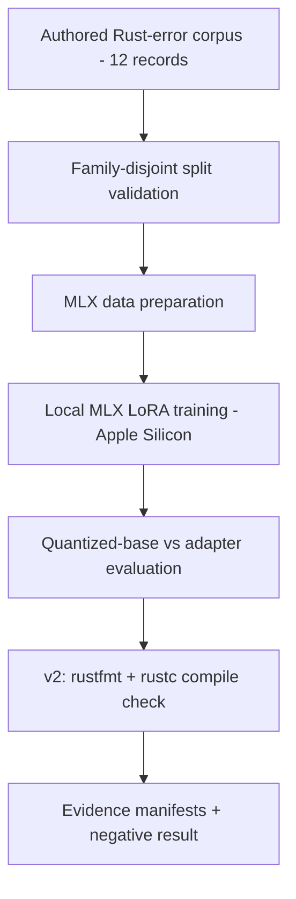

<p align="center">
  <h1 align="center">Model Adaptation Lab</h1>
  <p align="center">
    Reproducible model adaptation — including the negative result. An evidence-first
    experiment on structured Rust compiler-error explanations.
  </p>
</p>

<p align="center">
  <a href="https://github.com/rustfuture/model-adaptation-lab/actions/workflows/ci.yml"></a>
  
  <a href="LICENSE"></a>
  <a href="https://colab.research.google.com/github/rustfuture/model-adaptation-lab/blob/main/notebooks/validation_colab.ipynb"></a>
</p>

<p align="center">
  <a href="#status">Status</a> ·
  <a href="#experiment-flow">Flow</a> ·
  <a href="#what-was-run">What Was Run</a> ·
  <a href="#quick-start">Quick Start</a> ·
  <a href="#correctness-levels">Correctness</a> ·
  <a href="#limitations">Limitations</a>
</p>

<p align="center"><em>Colab runs dataset-contract and evidence validation only — not MLX training.</em></p>

This repository contains a reproducible data contract, split validator, deterministic
non-LLM baseline, and a local Apple-Silicon MLX LoRA training and evaluation pipeline for
structured Rust compiler-error explanations. All recorded runs were done locally on an
Apple M4 Pro (24 GB) with **zero cloud GPU or API spend**. The historical run produced a
negative result, and that result is preserved rather than hidden.

## Status

| Experiment | State |
|---|---|
| Historical v1 | Negative result preserved |
| Dataset contract | Verified |
| v2 pipeline | Implemented |
| Executable Rust evaluation | Implemented |
| Behavioral correctness | Not claimed |
| Full v2 model training | Runtime-dependent (Apple Silicon MLX; weights not in checkout) |

## Experiment Flow



## What Was Run

- **Dataset**: 12 authored, synthetic Rust-error records; no customer or scraped private data.
- **Split**: family-disjoint by authored label — train `parsing` + `indexing`, validation
  `ownership`, test `control_flow`. This reduces one source of overlap; it does not prove
  the absence of semantic duplicates or pretraining exposure.
- **Base model**: `Qwen/Qwen2.5-Coder-1.5B-Instruct` (Apache-2.0, commit
  `2e1fd397ee46e1388853d2af2c993145b0f1098a`), 4-bit MLX. Weights are not in this checkout.
- **Deterministic baseline**: error-code strategy classifier, 1/3 exact match on the
  three-record test holdout.
- **Historical LoRA run**: 50 iterations, rank 8, lr 1e-4, seed 42, peak memory 1.59 GB,
  10.2 s. The adapter was not retained, so there is no verifiable adapter hash.
- **Negative result**: the recorded adapter scored 0/3 on the held-out keyword proxy versus
  2/3 for the base model; exact strategy match was 0/3 for both. Lower latency on incorrect
  answers is not a quality improvement, and the cause of the failure is not established.

| Variant | Exact strategy match | Keyword coverage | Latency p50 | Latency max |
|---|---:|---:|---:|---:|
| MLX quantized base | 0/3 | 2/3 | 825 ms | 932 ms |
| MLX LoRA adapter | 0/3 | 0/3 | 355 ms | 403 ms |

The full narrative is in [`reports/negative-result.md`](reports/negative-result.md).

## Quick Start

The validation path is platform-independent and needs no model weights:

```bash
# 1. Validate dataset integrity and family-disjoint splits (v1 and v2)
python3 scripts/validate_dataset.py
python3 scripts/validate_dataset_v2.py

# 2. Compile every authored snippet and require the declared diagnostic (needs rustc)
python3 scripts/validate_rustc_snippets.py
python3 scripts/validate_rustc_snippets_v2.py

# 3. Deterministic non-LLM baseline
python3 scripts/baseline.py

# 4. Recompute the committed evidence manifest without model weights
python3 scripts/verify_evidence.py --write-manifest /tmp/evidence-metadata.json
diff -u evidence/metadata.json /tmp/evidence-metadata.json

# 5. Contract and provenance tests, plus the script-safety suite
python3 -m unittest discover -s tests -p 'test_dataset_contract.py'
python3 -m unittest discover -s tests -p 'test_v2_provenance.py'
./tests/test_script_safety.sh
```

The MLX training and evaluation path requires **Apple Silicon** with `mlx` and `mlx-lm`,
and the base weights (not in this checkout):

```bash
python3 scripts/prepare_mlx_data.py
scripts/prepare_mlx_model.sh     # fetch the pinned revision, build the 4-bit MLX directory
scripts/train_mlx_lora.sh        # isolated /tmp/model-lab-runs/<run_id>/
python3 scripts/evaluate_mlx.py --manifest /tmp/model-lab-runs/<run_id>/run_manifest.json
```

`./scripts/run_v2_experiment.sh` runs the full v2 pipeline. If the MLX weights are
unavailable, it reports the run as blocked rather than fabricating outputs.

## Correctness Levels

The v2 evaluation isolates model-produced Rust code, formats it with `rustfmt`, and checks
syntax and compilation with `rustc`. Keep the levels separate:

| Level | Meaning here | Established by |
|---|---|---|
| Compiles | The snippet builds as a standalone Rust 2021 binary | `validate_rustc_snippets_v2.py`, v2 evaluation |
| Behaviorally correct | The fixed code passes behavior tests | **Not claimed** — the dataset has no behavioral tests |
| Semantically correct | The diagnosis/fix is the right explanation | **Not claimed** — keyword and exact-match proxies only |

A compiling patch is not automatically a correct patch. Exact string match and keyword
coverage are narrow proxies, not format validation, compilation success, or semantic
correctness — and the corpus has only three held-out examples.

## V2 Reproducible Pipeline

- `scripts/evaluate_mlx_v2.py` performs the executable compile check described above.
- `data/rust_errors_v2.jsonl` adds explicit `fixed_code` blocks for end-to-end verification.
- `scripts/validate_rustc_snippets_v2.py` requires both that the original snippet raises
  the expected error and that the fixed snippet compiles.
- `scripts/validate_dataset_v2.py` / `scripts/evaluate_mlx_v2.py` carry v2 provenance
  (`data/rust_errors_v2.jsonl`); a deterministic test prevents v1 provenance from leaking
  into a v2 report.
- Historical v1 evidence is preserved unchanged.

## Safety and File-Protection Contract

All helper shell and Python scripts enforce defensive path and environment guards:

- User model, adapter, data, and source directories are never deleted or overwritten.
  Existing non-empty destination directories are rejected; cleanup is limited to temporary
  run directories whose ownership the process acquired atomically.
- Path-relationship checks cover every directory pair (`model`, `data`, `adapter`,
  `hf_source`), preventing collisions, parent/child nesting, symlink escape, root (`/`),
  home, and repository escapes without pre-check mutations.
- Unique atomic run directories (`/tmp/model-lab-runs/run-XXXXXX`) isolate training runs and
  emit a `run_manifest.json` with exact configuration metadata.
- Existing Hugging Face checkouts with local modifications are detected and preserved.
- Missing `git-lfs`, or absent `mlx_lm.convert` / `mlx_lm.lora`, produce clear errors.

These filesystem checks are **not** an adversarial OS sandbox. Compiler text and repository
code are treated as data, not instructions.

## Limitations

- **The negative result is the result.** This tiny experiment did not demonstrate a quality
  gain; do not read a general claim about LoRA or Qwen models from it.
- **No reusable adapter.** The historical adapter was not retained; the raw outputs support
  metric recomputation only, not full training reproduction.
- **Tiny holdout.** Three test records and a hand-authored keyword proxy cannot establish
  significance, equivalence, or semantic correctness.
- **Memorization is a hypothesis, not a mechanism.** Rising validation loss alongside low
  training loss is consistent with overfitting but does not establish its cause.
- **MLX is Apple-Silicon-specific.** The Colab notebook validates the dataset contract,
  baseline, and evidence only; it does not run or emulate MLX training.

## Repository Map

| Path | Contents |
|---|---|
| `data/rust_errors.jsonl` | Authored v1 corpus (12 records) |
| `data/rust_errors_v2.jsonl` | v2 corpus with explicit `fixed_code` blocks |
| `scripts/validate_dataset*.py` | Split-contract validation and manifests |
| `scripts/validate_rustc_snippets*.py` | Standalone rustc compile checks |
| `scripts/baseline.py` | Deterministic non-LLM baseline |
| `scripts/prepare_mlx_*.sh`, `scripts/train_mlx_lora*.sh` | Apple-Silicon MLX pipeline |
| `scripts/evaluate_mlx*.py` | Recorded-model evaluation (v1 and executable v2) |
| `scripts/verify_evidence.py` | Recompute the committed evidence manifest |
| `evidence/`, `reports/` | Recorded manifests, raw outputs, and the negative result |
| `tests/test_script_safety.sh` | Path/ownership safety suite |
| `notebooks/validation_colab.ipynb` | Platform-independent validation walkthrough |

## License

MIT — see [LICENSE](LICENSE).
