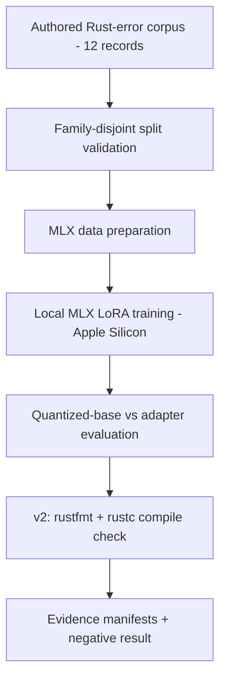

# Reference and Extended Results

This document preserves detailed run configurations, extended results tables, filesystem safety contracts, and repository structure for `model-adaptation-lab`.

## Recorded Environment

The recorded runs used an Apple M4 Pro with 24 GB unified memory ([`training-manifest.json`](../training-manifest.json)). The CI workflow uses Python 3.11 ([`.github/workflows/ci.yml`](../.github/workflows/ci.yml)).

## Experiment Status

| Experiment | State |
|---|---|
| Historical v1 | Negative result preserved |
| Dataset contract | Verified |
| v2 pipeline | Implemented |
| Executable Rust evaluation | Implemented |
| Behavioral correctness | Not claimed |
| Full v2 model training | Runtime-dependent (Apple Silicon MLX; weights not in checkout) |

## Experiment Flow

## What Was Run

- **Dataset**: 12 authored, synthetic Rust-error records; no customer or scraped private data ([`data/rust_errors.jsonl`](../data/rust_errors.jsonl), [`evidence/dataset-validation.json`](../evidence/dataset-validation.json)).
- **Split**: family-disjoint by authored label — train `parsing` + `indexing`, validation `ownership`, test `control_flow` ([`evidence/dataset-validation.json`](../evidence/dataset-validation.json), [`scripts/validate_dataset.py`](../scripts/validate_dataset.py)). This reduces one source of overlap; it does not prove the absence of semantic duplicates or pretraining exposure.
- **Base model**: `Qwen/Qwen2.5-Coder-1.5B-Instruct` (Apache-2.0, commit `2e1fd397ee46e1388853d2af2c993145b0f1098a`), 4-bit MLX ([`training-manifest.json`](../training-manifest.json), [`reports/model-selection.md`](../reports/model-selection.md)). Weights are not in this checkout.
- **Deterministic baseline**: error-code strategy classifier, 1/3 exact match on the three-record test holdout ([`scripts/baseline.py`](../scripts/baseline.py)).
- **Historical LoRA run**: 50 iterations, rank 8, lr 1e-4, seed 42, peak memory 1.59 GB, 10.2 s ([`training-manifest.json`](../training-manifest.json), [`reports/training-run-2026-09-06.md`](../reports/training-run-2026-09-06.md)). The adapter was not retained, so there is no verifiable adapter hash.
- **Negative result**: the recorded adapter scored 0/3 on the held-out keyword proxy versus 2/3 for the base model; exact strategy match was 0/3 for both ([`evidence/metadata.json`](../evidence/metadata.json), [`reports/negative-result.md`](../reports/negative-result.md)). Lower latency on incorrect answers is not a quality improvement, and the cause of the failure is not established.

### Results Table

| Variant | Exact strategy match | Keyword coverage | Latency p50 | Latency max |
|---|---:|---:|---:|---:|
| MLX quantized base | 0/3 | 2/3 | 825 ms | 932 ms |
| MLX LoRA adapter | 0/3 | 0/3 | 355 ms | 403 ms |

*Recomputed from raw outputs in [`evidence/metadata.json`](../evidence/metadata.json), [`evidence/raw/mlx_base_quantized-test.jsonl`](../evidence/raw/mlx_base_quantized-test.jsonl), and [`evidence/raw/mlx_lora_adapter-test.jsonl`](../evidence/raw/mlx_lora_adapter-test.jsonl). The full narrative is in [`reports/negative-result.md`](../reports/negative-result.md).*

## V2 Reproducible Pipeline

- `scripts/evaluate_mlx_v2.py` performs executable compile checks via `rustc`.
- `data/rust_errors_v2.jsonl` adds explicit `fixed_code` blocks for end-to-end verification.
- `scripts/validate_rustc_snippets_v2.py` requires both that the original snippet raises the expected error and that the fixed snippet compiles.
- `scripts/validate_dataset_v2.py` / `scripts/evaluate_mlx_v2.py` carry v2 provenance (`data/rust_errors_v2.jsonl`); a deterministic test prevents v1 provenance from leaking into a v2 report.
- Historical v1 evidence is preserved unchanged.

## Safety and File-Protection Contract

All helper shell and Python scripts enforce defensive path and environment guards (tested in [`tests/test_script_safety.sh`](../tests/test_script_safety.sh)):

- User model, adapter, data, and source directories are never deleted or overwritten. Existing non-empty destination directories are rejected; cleanup is limited to temporary run directories whose ownership the process acquired atomically.
- Path-relationship checks cover every directory pair (`model`, `data`, `adapter`, `hf_source`), preventing collisions, parent/child nesting, symlink escape, root (`/`), home, and repository escapes without pre-check mutations.
- Unique atomic run directories (`/tmp/model-lab-runs/run-XXXXXX`) isolate training runs and emit a `run_manifest.json` with exact configuration metadata.
- Existing Hugging Face checkouts with local modifications are detected and preserved.
- Missing `git-lfs`, or absent `mlx_lm.convert` / `mlx_lm.lora`, produce clear errors.

These filesystem checks are **not** an adversarial OS sandbox. Compiler text and repository code are treated as data, not instructions.

## Repository Map

| Path | Contents |
|---|---|
| `data/rust_errors.jsonl` | Authored v1 corpus (12 records) |
| `data/rust_errors_v2.jsonl` | v2 corpus with explicit `fixed_code` blocks |
| `scripts/validate_dataset*.py` | Split-contract validation and manifests |
| `scripts/validate_rustc_snippets*.py` | Standalone rustc compile checks |
| `scripts/baseline.py` | Deterministic non-LLM baseline |
| `scripts/prepare_mlx_*.sh`, `scripts/train_mlx_lora*.sh` | Apple-Silicon MLX pipeline |
| `scripts/evaluate_mlx*.py` | Recorded-model evaluation (v1 and executable v2) |
| `scripts/verify_evidence.py` | Recompute the committed evidence manifest |
| `evidence/`, `reports/` | Recorded manifests, raw outputs, and the negative result |
| `tests/test_script_safety.sh` | Path/ownership safety suite |
| `notebooks/validation_colab.ipynb` | Platform-independent validation walkthrough |
